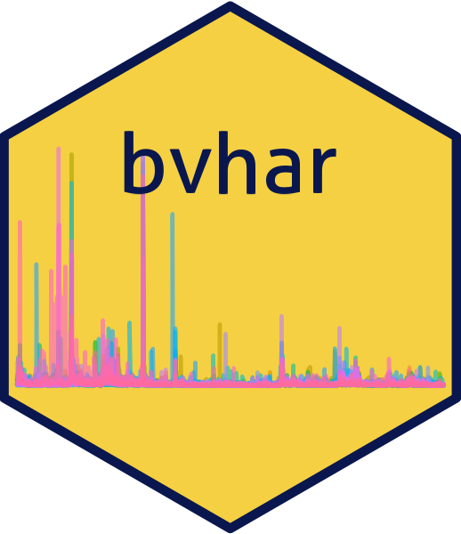

<!-- README.md is generated from README.Rmd. Please edit that file -->

```{r, include = FALSE}
knitr::opts_chunk$set(
  collapse = TRUE,
  comment = "#>",
  fig.path = "man/figures/README-",
  # custom setting-----------------
  out.width = "70%",
  fig.align = "center",
  fig.width = 6,
  fig.asp = .618
)
options(digits = 3)
```

# bvhar 

<!-- badges: start -->
[](https://github.com/ygeunkim/bvhar/actions)
[](https://app.codecov.io/gh/ygeunkim/bvhar)
[](https://CRAN.R-project.org/package=bvhar)
[](https://cran.r-project.org/package=bvhar)
[](https://cran.r-project.org/package=bvhar)
<!-- badges: end -->

## Overview

`bvhar` provides functions to analyze multivariate time series time series using

- VAR
- VHAR (Vector HAR)
- BVAR (Bayesian VAR)
- **BVHAR (Bayesian VHAR)**

Basically, the package focuses on the research with forecasting.

## Installation

```{r craninst, eval=FALSE}
install.packages("bvhar")
```

### Development version

You can install the development version from this repository.

```{r devinst, eval=FALSE}
# install.packages("remotes")
remotes::install_github("ygeunkim/bvhar")
```

## Models

```{r example, message=FALSE}
library(bvhar) # this package
library(dplyr)
```

Repeatedly, `bvhar` is a research tool to analyze multivariate time series model above

| Model | function | prior |  
|:-----:|:--------:|:-----:|  
| VAR | `var_lm()` | |  
| VHAR | `vhar_lm()` | |  
| BVAR | `bvar_minnesota()` | Minnesota |  
| BVHAR | `bvhar_minnesota()` | Minnesota |  
| BVAR-SV | `bvar_sv()` | SSVS, Horseshoe |  
| BVHAR-SV | `bvhar_sv()` | SSVS, Horseshoe |  

This readme document shows forecasting procedure briefly.
Details about each function are in vignettes and help documents.

h-step ahead forecasting:

```{r datasplit}
h <- 19
etf_split <- divide_ts(etf_vix, h) # Try ?divide_ts
etf_tr <- etf_split$train
etf_te <- etf_split$test
```

### VAR

VAR(5):

```{r fitvar}
mod_var <- var_lm(y = etf_tr, p = 5)
```

Forecasting:

```{r predvar}
forecast_var <- predict(mod_var, h)
```

MSE:

```{r testvar}
(msevar <- mse(forecast_var, etf_te))
```

### VHAR

```{r fitvhar}
mod_vhar <- vhar_lm(y = etf_tr)
```

MSE:

```{r predvhar}
forecast_vhar <- predict(mod_vhar, h)
(msevhar <- mse(forecast_vhar, etf_te))
```

### BVAR

Minnesota prior:

```{r specbvar}
lam <- .3
delta <- rep(1, ncol(etf_vix)) # litterman
sig <- apply(etf_tr, 2, sd)
eps <- 1e-04
(bvar_spec <- set_bvar(sig, lam, delta, eps))
```

```{r fitbvar}
mod_bvar <- bvar_minnesota(y = etf_tr, p = 5, bayes_spec = bvar_spec)
```

MSE:

```{r }
forecast_bvar <- predict(mod_bvar, h)
(msebvar <- mse(forecast_bvar, etf_te))
```

### BVHAR

BVHAR-S:

```{r specbvhars}
(bvhar_spec_v1 <- set_bvhar(sig, lam, delta, eps))
```

```{r fitbvhars}
mod_bvhar_v1 <- bvhar_minnesota(y = etf_tr, bayes_spec = bvhar_spec_v1)
```

MSE:

```{r predbvhars}
forecast_bvhar_v1 <- predict(mod_bvhar_v1, h)
(msebvhar_v1 <- mse(forecast_bvhar_v1, etf_te))
```

BVHAR-L:

```{r specbvharl}
day <- rep(.1, ncol(etf_vix))
week <- rep(.1, ncol(etf_vix))
month <- rep(.1, ncol(etf_vix))
#----------------------------------
(bvhar_spec_v2 <- set_weight_bvhar(sig, lam, eps, day, week, month))
```

```{r fitbvharl}
mod_bvhar_v2 <- bvhar_minnesota(y = etf_tr, bayes_spec = bvhar_spec_v2)
```

MSE:

```{r predbvharl}
forecast_bvhar_v2 <- predict(mod_bvhar_v2, h)
(msebvhar_v2 <- mse(forecast_bvhar_v2, etf_te))
```

## Plots

```{r predfig}
autoplot(forecast_var, x_cut = 870, ci_alpha = .7, type = "wrap") +
  autolayer(forecast_vhar, ci_alpha = .6) +
  autolayer(forecast_bvar, ci_alpha = .4) +
  autolayer(forecast_bvhar_v1, ci_alpha = .2) +
  autolayer(forecast_bvhar_v2, ci_alpha = .1)
```

## Citation

Please cite this package with following BibTeX:

```{r cite-pkg, echo=FALSE, comment=NULL}
toBibtex(citation("bvhar", auto = FALSE))
```

## Code of Conduct
  
  Please note that the bvhar project is released with a [Contributor Code of Conduct](https://contributor-covenant.org/version/2/0/CODE_OF_CONDUCT.html). By contributing to this project, you agree to abide by its terms.
