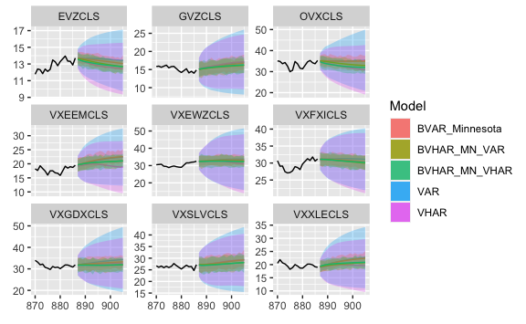

<!-- README.md is generated from README.Rmd. Please edit that file -->

# bvhar 

<!-- badges: start -->

[](https://github.com/ygeunkim/bvhar/actions)
[](https://app.codecov.io/gh/ygeunkim/bvhar)
[](https://CRAN.R-project.org/package=bvhar)
[](https://cran.r-project.org/package=bvhar)
[](https://cran.r-project.org/package=bvhar)
<!-- badges: end -->

## Overview

`bvhar` provides functions to analyze multivariate time series time
series using

- VAR
- VHAR (Vector HAR)
- BVAR (Bayesian VAR)
- **BVHAR (Bayesian VHAR)**

Basically, the package focuses on the research with forecasting.

## Installation

``` r
install.packages("bvhar")
```

### Development version

You can install the development version from [develop
branch](https://github.com/ygeunkim/bvhar/tree/develop).

``` r
# install.packages("remotes")
remotes::install_github("ygeunkim/bvhar@develop")
```

## Models

``` r
library(bvhar) # this package
library(dplyr)
```

Repeatedly, `bvhar` is a research tool to analyze multivariate time
series model above

|  Model   |      function       |      prior      |
|:--------:|:-------------------:|:---------------:|
|   VAR    |     `var_lm()`      |                 |
|   VHAR   |     `vhar_lm()`     |                 |
|   BVAR   | `bvar_minnesota()`  |    Minnesota    |
|  BVHAR   | `bvhar_minnesota()` |    Minnesota    |
| BVAR-SV  |     `bvar_sv()`     | SSVS, Horseshoe |
| BVHAR-SV |    `bvhar_sv()`     | SSVS, Horseshoe |

This readme document shows forecasting procedure briefly. Details about
each function are in vignettes and help documents.

h-step ahead forecasting:

``` r
h <- 19
etf_split <- divide_ts(etf_vix, h) # Try ?divide_ts
etf_tr <- etf_split$train
etf_te <- etf_split$test
```

### VAR

VAR(5):

``` r
mod_var <- var_lm(y = etf_tr, p = 5)
```

Forecasting:

``` r
forecast_var <- predict(mod_var, h)
```

MSE:

``` r
(msevar <- mse(forecast_var, etf_te))
#>   GVZCLS   OVXCLS VXFXICLS VXEEMCLS VXSLVCLS   EVZCLS VXXLECLS VXGDXCLS 
#>    5.381   14.689    2.838    9.451   10.078    0.654   22.436    9.992 
#> VXEWZCLS 
#>   10.647
```

### VHAR

``` r
mod_vhar <- vhar_lm(y = etf_tr)
```

MSE:

``` r
forecast_vhar <- predict(mod_vhar, h)
(msevhar <- mse(forecast_vhar, etf_te))
#>   GVZCLS   OVXCLS VXFXICLS VXEEMCLS VXSLVCLS   EVZCLS VXXLECLS VXGDXCLS 
#>     6.15     2.49     1.52     1.58    10.55     1.35     8.79     4.43 
#> VXEWZCLS 
#>     3.84
```

### BVAR

Minnesota prior:

``` r
lam <- .3
delta <- rep(1, ncol(etf_vix)) # litterman
sig <- apply(etf_tr, 2, sd)
eps <- 1e-04
(bvar_spec <- set_bvar(sig, lam, delta, eps))
#> Model Specification for BVAR
#> 
#> Parameters: Coefficent matrice and Covariance matrix
#> Prior: Minnesota
#> # Type '?bvar_minnesota' in the console for some help.
#> ========================================================
#> 
#> Setting for 'sigma':
#>   GVZCLS    OVXCLS  VXFXICLS  VXEEMCLS  VXSLVCLS    EVZCLS  VXXLECLS  VXGDXCLS  
#>     3.77     10.63      3.81      4.39      5.99      2.27      4.88      7.45  
#> VXEWZCLS  
#>     7.03  
#> 
#> Setting for 'lambda':
#> [1]  0.3
#> 
#> Setting for 'delta':
#> [1]  1  1  1  1  1  1  1  1  1
#> 
#> Setting for 'eps':
#> [1]  1e-04
```

``` r
mod_bvar <- bvar_minnesota(y = etf_tr, p = 5, bayes_spec = bvar_spec)
```

MSE:

``` r
forecast_bvar <- predict(mod_bvar, h)
(msebvar <- mse(forecast_bvar, etf_te))
#>   GVZCLS   OVXCLS VXFXICLS VXEEMCLS VXSLVCLS   EVZCLS VXXLECLS VXGDXCLS 
#>    4.463   13.510    1.336   11.267    9.802    0.862   21.929    5.418 
#> VXEWZCLS 
#>    7.362
```

### BVHAR

BVHAR-S:

``` r
(bvhar_spec_v1 <- set_bvhar(sig, lam, delta, eps))
#> Model Specification for BVHAR
#> 
#> Parameters: Coefficent matrice and Covariance matrix
#> Prior: MN_VAR
#> # Type '?bvhar_minnesota' in the console for some help.
#> ========================================================
#> 
#> Setting for 'sigma':
#>   GVZCLS    OVXCLS  VXFXICLS  VXEEMCLS  VXSLVCLS    EVZCLS  VXXLECLS  VXGDXCLS  
#>     3.77     10.63      3.81      4.39      5.99      2.27      4.88      7.45  
#> VXEWZCLS  
#>     7.03  
#> 
#> Setting for 'lambda':
#> [1]  0.3
#> 
#> Setting for 'delta':
#> [1]  1  1  1  1  1  1  1  1  1
#> 
#> Setting for 'eps':
#> [1]  1e-04
```

``` r
mod_bvhar_v1 <- bvhar_minnesota(y = etf_tr, bayes_spec = bvhar_spec_v1)
```

MSE:

``` r
forecast_bvhar_v1 <- predict(mod_bvhar_v1, h)
(msebvhar_v1 <- mse(forecast_bvhar_v1, etf_te))
#>   GVZCLS   OVXCLS VXFXICLS VXEEMCLS VXSLVCLS   EVZCLS VXXLECLS VXGDXCLS 
#>     3.58     4.76     1.32     5.71     6.29     1.15    14.03     2.52 
#> VXEWZCLS 
#>     5.41
```

BVHAR-L:

``` r
day <- rep(.1, ncol(etf_vix))
week <- rep(.1, ncol(etf_vix))
month <- rep(.1, ncol(etf_vix))
#----------------------------------
(bvhar_spec_v2 <- set_weight_bvhar(sig, lam, eps, day, week, month))
#> Model Specification for BVHAR
#> 
#> Parameters: Coefficent matrice and Covariance matrix
#> Prior: MN_VHAR
#> # Type '?bvhar_minnesota' in the console for some help.
#> ========================================================
#> 
#> Setting for 'sigma':
#>   GVZCLS    OVXCLS  VXFXICLS  VXEEMCLS  VXSLVCLS    EVZCLS  VXXLECLS  VXGDXCLS  
#>     3.77     10.63      3.81      4.39      5.99      2.27      4.88      7.45  
#> VXEWZCLS  
#>     7.03  
#> 
#> Setting for 'lambda':
#> [1]  0.3
#> 
#> Setting for 'eps':
#> [1]  1e-04
#> 
#> Setting for 'daily':
#> [1]  0.1  0.1  0.1  0.1  0.1  0.1  0.1  0.1  0.1
#> 
#> Setting for 'weekly':
#> [1]  0.1  0.1  0.1  0.1  0.1  0.1  0.1  0.1  0.1
#> 
#> Setting for 'monthly':
#> [1]  0.1  0.1  0.1  0.1  0.1  0.1  0.1  0.1  0.1
```

``` r
mod_bvhar_v2 <- bvhar_minnesota(y = etf_tr, bayes_spec = bvhar_spec_v2)
```

MSE:

``` r
forecast_bvhar_v2 <- predict(mod_bvhar_v2, h)
(msebvhar_v2 <- mse(forecast_bvhar_v2, etf_te))
#>   GVZCLS   OVXCLS VXFXICLS VXEEMCLS VXSLVCLS   EVZCLS VXXLECLS VXGDXCLS 
#>     3.63     4.39     1.37     5.63     6.16     1.19    14.18     2.52 
#> VXEWZCLS 
#>     5.23
```

## Plots

``` r
autoplot(forecast_var, x_cut = 870, ci_alpha = .7, type = "wrap") +
  autolayer(forecast_vhar, ci_alpha = .6) +
  autolayer(forecast_bvar, ci_alpha = .4) +
  autolayer(forecast_bvhar_v1, ci_alpha = .2) +
  autolayer(forecast_bvhar_v2, ci_alpha = .1)
```



## Citation

Please cite this package with following BibTeX:

    @Manual{,
      title = {{bvhar}: Bayesian Vector Heterogeneous Autoregressive Modeling},
      author = {Young Geun Kim and Changryong Baek},
      year = {2023},
      note = {R package version 2.0.0},
      url = {https://cran.r-project.org/package=bvhar},
    }

    @Article{,
      title = {Bayesian Vector Heterogeneous Autoregressive Modeling},
      author = {Young Geun Kim and Changryong Baek},
      journal = {Journal of Statistical Computation and Simulation},
      year = {2023},
      doi = {10.1080/00949655.2023.2281644},
    }

## Code of Conduct

Please note that the bvhar project is released with a [Contributor Code
of
Conduct](https://contributor-covenant.org/version/2/0/CODE_OF_CONDUCT.html).
By contributing to this project, you agree to abide by its terms.
