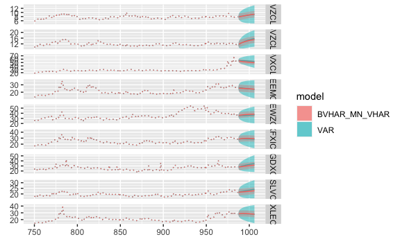

<!-- README.md is generated from README.Rmd. Please edit that file -->

# bvhar 

<!-- badges: start -->

[](https://lifecycle.r-lib.org/articles/stages.html#experimental)
[](https://github.com/ygeunkim/bvhar/actions)
[](https://codecov.io/gh/ygeunkim/bvhar?branch=master)
<!-- badges: end -->

## Overview

`bvhar` provides functions to analyze multivariate time series time
series using

-   VAR
-   VHAR (Vector HAR)
-   BVAR (Bayesian VAR)
-   **BVHAR (Bayesian VHAR)**

Basically, the package focuses on the research with forecasting.

## Installation

You can only install the development version at this point.

``` r
# install.packages("remotes")
remotes::install_github("ygeunkim/bvhar")
```

## Models

``` r
library(bvhar) # this package
library(dplyr)
```

Repeatedly, `bvhar` is a research tool to analyze multivariate time
series model above

| Model |     function      |     S3     |
|:-----:|:-----------------:|:----------:|
|  VAR  |     `var_lm`      |  `varlse`  |
| VHAR  |     `vhar_lm`     | `vharlse`  |
| BVAR  | `bvar_minnesota`  |  `bvarmn`  |
| BVAR  |    `bvar_flat`    | `bvarflat` |
| BVHAR | `bvhar_minnesota` | `bvharmn`  |

As the other analyzer tools use S3 such as `lm`, this package use
methods `coef`, `predict`, etc. This readme document shows out-of-sample
forecasting briefly. Details about each function are in vignettes and
help documents.

Out-of-sample forecasting:

``` r
h <- 19
etf_split <- divide_ts(etf_vix, h) # Try ?divide_ts
etf_tr <- etf_split$train
etf_te <- etf_split$test
```

### VAR

VAR(5):

``` r
mod_var <- var_lm(etf_tr, 5)
```

Forecasting:

``` r
forecast_var <- predict(mod_var, h)
```

MSE:

``` r
(msevar <- mse(forecast_var, etf_te))
#>   EVZCLS   GVZCLS   OVXCLS VXEEMCLS VXEWZCLS VXFXICLS VXGDXCLS VXSLVCLS 
#>    0.675    1.817   42.797   14.652    4.376   14.686    9.149    4.947 
#> VXXLECLS 
#>   80.670
```

### VHAR

``` r
mod_vhar <- vhar_lm(etf_tr)
```

MSE:

``` r
forecast_vhar <- predict(mod_vhar, h)
(msevhar <- mse(forecast_vhar, etf_te))
#>   EVZCLS   GVZCLS   OVXCLS VXEEMCLS VXEWZCLS VXFXICLS VXGDXCLS VXSLVCLS 
#>     2.34     4.69    57.58    14.73     6.07     5.45     8.94     4.36 
#> VXXLECLS 
#>    95.97
```

### BVAR

Minnesota prior:

``` r
lam <- .3
delta <- rep(1, ncol(etf_vix)) # litterman
sig <- apply(etf_tr, 2, sd)
eps <- 1e-04
(bvar_spec <- set_bvar(sig, lam, delta, eps))
#> Model Specification for BVAR
#> 
#> Parameters: Coefficent matrice and Covariance matrix
#> Prior: Minnesota
#> **Read corresponding document for the details of the distribution.**
#> ====================================================================
#> 
#> Setting for 'sigma':
#>   EVZCLS    GVZCLS    OVXCLS  VXEEMCLS  VXEWZCLS  VXFXICLS  VXGDXCLS  VXSLVCLS  
#>     2.20      3.26     11.15      5.12      7.81      6.85     11.04      4.94  
#> VXXLECLS  
#>     6.25  
#> 
#> Setting for 'lambda':
#> [1]  0.3
#> 
#> Setting for 'delta':
#> [1]  1  1  1  1  1  1  1  1  1
#> 
#> Setting for 'eps':
#> [1]  1e-04
```

``` r
mod_bvar <- bvar_minnesota(etf_tr, 5, bvar_spec)
```

MSE:

``` r
forecast_bvar <- predict(mod_bvar, h)
(msebvar <- mse(forecast_bvar, etf_te))
#>   EVZCLS   GVZCLS   OVXCLS VXEEMCLS VXEWZCLS VXFXICLS VXGDXCLS VXSLVCLS 
#>    0.534    1.337   50.211   17.453    3.441   15.745   16.552    4.098 
#> VXXLECLS 
#>   88.957
```

### BVHAR

VAR-type Minnesota prior:

``` r
(bvhar_spec_v1 <- set_bvhar(sig, lam, delta, eps))
#> Model Specification for BVHAR
#> 
#> Parameters: Coefficent matrice and Covariance matrix
#> Prior: MN_VAR
#> **Read corresponding document for the details of the distribution.**
#> ====================================================================
#> 
#> Setting for 'sigma':
#>   EVZCLS    GVZCLS    OVXCLS  VXEEMCLS  VXEWZCLS  VXFXICLS  VXGDXCLS  VXSLVCLS  
#>     2.20      3.26     11.15      5.12      7.81      6.85     11.04      4.94  
#> VXXLECLS  
#>     6.25  
#> 
#> Setting for 'lambda':
#> [1]  0.3
#> 
#> Setting for 'delta':
#> [1]  1  1  1  1  1  1  1  1  1
#> 
#> Setting for 'eps':
#> [1]  1e-04
```

``` r
mod_bvhar_v1 <- bvhar_minnesota(etf_tr, bvhar_spec_v1)
```

MSE:

``` r
forecast_bvhar_v1 <- predict(mod_bvhar_v1, h)
(msebvhar_v1 <- mse(forecast_bvhar_v1, etf_te))
#>   EVZCLS   GVZCLS   OVXCLS VXEEMCLS VXEWZCLS VXFXICLS VXGDXCLS VXSLVCLS 
#>    0.952    1.937   47.983   14.109    1.775    9.288   15.379    3.836 
#> VXXLECLS 
#>   79.779
```

VHAR-type Minnesota prior:

``` r
day <- rep(.1, ncol(etf_vix))
week <- rep(.1, ncol(etf_vix))
month <- rep(.1, ncol(etf_vix))
#----------------------------------
(bvhar_spec_v2 <- set_weight_bvhar(sig, lam, eps, day, week, month))
#> Model Specification for BVHAR
#> 
#> Parameters: Coefficent matrice and Covariance matrix
#> Prior: MN_VHAR
#> **Read corresponding document for the details of the distribution.**
#> ====================================================================
#> 
#> Setting for 'sigma':
#>   EVZCLS    GVZCLS    OVXCLS  VXEEMCLS  VXEWZCLS  VXFXICLS  VXGDXCLS  VXSLVCLS  
#>     2.20      3.26     11.15      5.12      7.81      6.85     11.04      4.94  
#> VXXLECLS  
#>     6.25  
#> 
#> Setting for 'lambda':
#> [1]  0.3
#> 
#> Setting for 'eps':
#> [1]  1e-04
#> 
#> Setting for 'daily':
#> [1]  0.1  0.1  0.1  0.1  0.1  0.1  0.1  0.1  0.1
#> 
#> Setting for 'weekly':
#> [1]  0.1  0.1  0.1  0.1  0.1  0.1  0.1  0.1  0.1
#> 
#> Setting for 'monthly':
#> [1]  0.1  0.1  0.1  0.1  0.1  0.1  0.1  0.1  0.1
```

``` r
mod_bvhar_v2 <- bvhar_minnesota(etf_tr, bvhar_spec_v2)
```

``` r
forecast_bvhar_v2 <- predict(mod_bvhar_v2, h)
(msebvhar_v2 <- mse(forecast_bvhar_v2, etf_te))
#>   EVZCLS   GVZCLS   OVXCLS VXEEMCLS VXEWZCLS VXFXICLS VXGDXCLS VXSLVCLS 
#>     1.11     1.83    42.50    12.94     1.56     3.54    17.02     3.55 
#> VXXLECLS 
#>    71.88
```

## Compare Models

### Layers

``` r
autoplot(forecast_var, x_cut = 1000, ci_alpha = .7, type = "wrap") +
  autolayer(forecast_vhar, ci_alpha = .6) +
  autolayer(forecast_bvar, ci_alpha = .4) +
  autolayer(forecast_bvhar_v1, ci_alpha = .2) +
  autolayer(forecast_bvhar_v2, ci_alpha = .1)
```



### Erros

``` r
list(
  forecast_var,
  forecast_vhar,
  forecast_bvar,
  forecast_bvhar_v2
) %>% 
  plot_loss(y = etf_te) +
  ggplot2::theme_minimal() +
  ggplot2::theme(axis.text.x = ggplot2::element_text(angle = -45, vjust = -1))
```


## Code of Conduct

Please note that the bvhar project is released with a [Contributor Code
of
Conduct](https://contributor-covenant.org/version/2/0/CODE_OF_CONDUCT.html).
By contributing to this project, you agree to abide by its terms.
