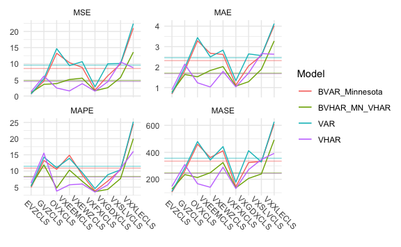

<!-- README.md is generated from README.Rmd. Please edit that file -->

# bvhar 

<!-- badges: start -->

[](https://lifecycle.r-lib.org/articles/stages.html#experimental)
[](https://github.com/ygeunkim/bvhar/actions)
[](https://codecov.io/gh/ygeunkim/bvhar?branch=master)
<!-- badges: end -->

## Overview

`bvhar` provides functions to analyze multivariate time series time
series using

-   VAR
-   VHAR (Vector HAR)
-   BVAR (Bayesian VAR)
-   **BVHAR (Bayesian VHAR)**

Basically, the package focuses on the research with forecasting.

## Installation

You can only install the development version at this point.

``` r
# install.packages("remotes")
remotes::install_github("ygeunkim/bvhar")
```

## Usage

``` r
library(bvhar)
library(dplyr)
library(ggplot2)
```

### VAR

Out-of-sample forecasting:

``` r
h <- 19
etf_tr <-
  etf_vix %>%
  slice(seq_len(n() - h))
#-------------------
etf_te <- setdiff(etf_vix, etf_tr)
```

VAR(1):

``` r
mod_var <- var_lm(etf_tr, 1)
```

Forecasting:

``` r
forecast_var <- predict(mod_var, h)
```

MSE:

``` r
(msevar <- mse(forecast_var, etf_te))
#>    EVZCLS    GVZCLS    OVXCLS  VXEEMCLS  VXEWZCLS  VXFXICLS  VXGDXCLS  VXSLVCLS 
#>  1.920100  2.767665 56.480501  6.909928  1.884014  2.844713  4.448146  9.536520 
#>  VXXLECLS 
#> 45.142567
```

### VHAR

``` r
mod_vhar <- vhar_lm(etf_tr)
```

MSE:

``` r
forecast_vhar <- predict(mod_vhar, h)
(msevhar <- mse(forecast_vhar, etf_te))
#>    EVZCLS    GVZCLS    OVXCLS  VXEEMCLS  VXEWZCLS  VXFXICLS  VXGDXCLS  VXSLVCLS 
#>  2.574746  6.387274 70.829157  4.321342  3.086089  5.341502  4.378567  7.636454 
#>  VXXLECLS 
#> 52.135727
```

### BVAR

Minnesota prior:

``` r
lam <- .2
delta <- rep(0, ncol(etf_vix)) # litterman
sig <- apply(etf_tr, 2, sd)
eps <- 1e-04
```

``` r
mod_bvar <- bvar_minnesota(etf_tr, 5, sig, lam, delta, eps)
```

MSE:

``` r
forecast_bvar <- predict(mod_bvar, h)
(msebvar <- mse(forecast_bvar, etf_te))
#>    EVZCLS    GVZCLS    OVXCLS  VXEEMCLS  VXEWZCLS  VXFXICLS  VXGDXCLS  VXSLVCLS 
#>  1.675226  3.007671 53.085572  4.233823  5.998921  3.847304  4.247299  8.387925 
#>  VXXLECLS 
#> 42.483580
```

### BVHAR

Minnesota-v1:

``` r
mod_bvhar_v1 <- bvhar_minnesota(etf_tr, sigma = sig, lambda = lam, delta = delta, eps = eps)
```

MSE:

``` r
forecast_bvhar_v1 <- predict(mod_bvhar_v1, h)
(msebvhar_v1 <- mse(forecast_bvhar_v1, etf_te))
#>    EVZCLS    GVZCLS    OVXCLS  VXEEMCLS  VXEWZCLS  VXFXICLS  VXGDXCLS  VXSLVCLS 
#>  1.707028  3.453921 48.813705  3.388200  8.974295  5.351510  4.725564  6.815297 
#>  VXXLECLS 
#> 41.515688
```

Minnesota-v2:

``` r
day <- rep(.1, ncol(etf_vix))
week <- rep(.1, ncol(etf_vix))
month <- rep(.1, ncol(etf_vix))
#-------------------------------
mod_bvhar_v2 <- bvhar_minnesota(
  etf_tr, 
  type = "VHAR", 
  sigma = sig, 
  lambda = lam, 
  daily = day, 
  weekly = week, 
  monthly = month, 
  eps = eps
)
```

``` r
forecast_bvhar_v2 <- predict(mod_bvhar_v2, h)
(msebvhar_v2 <- mse(forecast_bvhar_v2, etf_te))
#>    EVZCLS    GVZCLS    OVXCLS  VXEEMCLS  VXEWZCLS  VXFXICLS  VXGDXCLS  VXSLVCLS 
#>  1.568791  2.903725 43.408822  2.895090  7.916399  5.961531  5.411489  6.573031 
#>  VXXLECLS 
#> 37.812749
```

Comparing:



``` r
# VAR---------------
mean(msevar)
#> [1] 14.65935
# VHAR--------------
mean(msevhar)
#> [1] 17.4101
# BVAR--------------
mean(msebvar)
#> [1] 14.10748
# BVHAR-------------
mean(msebvhar_v1)
#> [1] 13.86058
mean(msebvhar_v2)
#> [1] 12.71685
```
