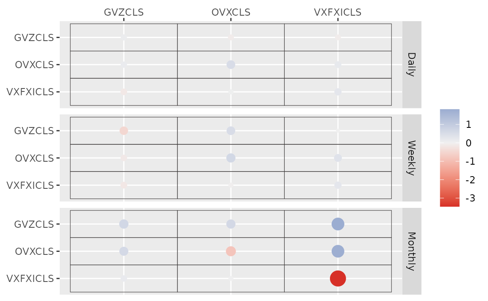
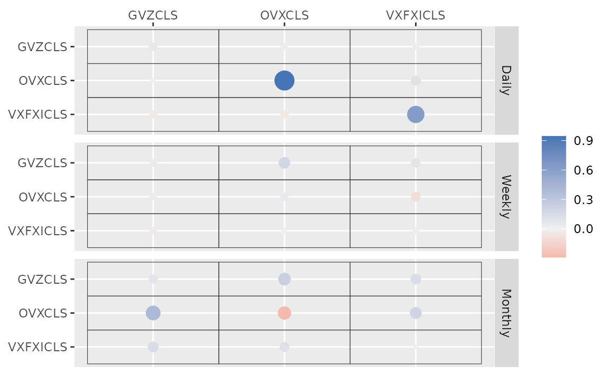
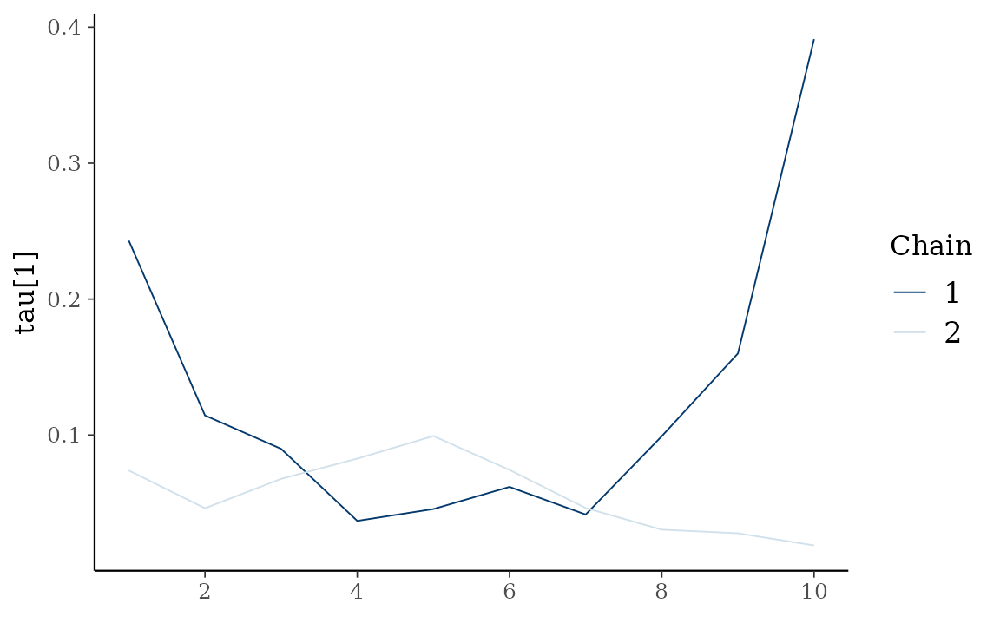
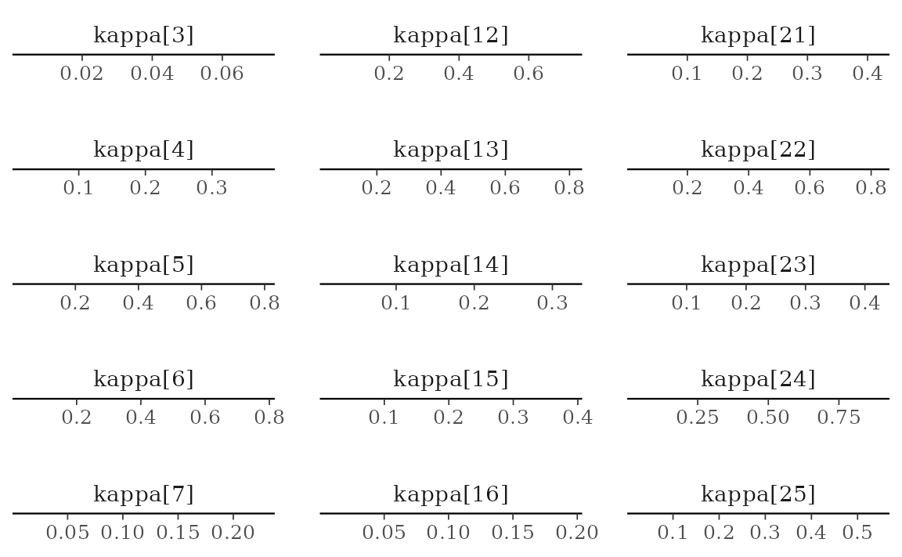

# Bayesian VAR and VHAR Models

``` r

library(bvhar)
```

``` r

etf <- etf_vix[1:55, 1:3]
# Split-------------------------------
h <- 5
etf_eval <- divide_ts(etf, h)
etf_train <- etf_eval$train
etf_test <- etf_eval$test
```

## Bayesian VAR and VHAR

[`var_bayes()`](../reference/var_bayes.md) and
[`vhar_bayes()`](../reference/vhar_bayes.md) fit BVAR and BVHAR each
with various priors.

- `y`: Multivariate time series data. It should be data frame or matrix,
  which means that every column is numeric. Each column indicates
  variable, i.e. it sould be wide format.
- `p` or `har`: VAR lag, or order of VHAR
- `num_chains`: Number of chains
  - If OpenMP is enabled, parallel loop will be run.
- `num_iter`: Total number of iterations
- `num_burn`: Number of burn-in
- `thinning`: Thinning
- `coef_spec`: Coefficient prior specification.
  - Minneosta prior
    - BVAR: [`set_bvar()`](../reference/set_bvar.md)
    - BVHAR: [`set_bvhar()`](../reference/set_bvar.md) and
      [`set_weight_bvhar()`](../reference/set_bvar.md)
    - Can induce prior on $`\lambda`$ using `lambda = set_lambda()`
  - SSVS prior: [`set_ssvs()`](../reference/set_ssvs.md)
  - Horseshoe prior: [`set_horseshoe()`](../reference/set_horseshoe.md)
  - NG prior: [`set_ng()`](../reference/set_ng.md)
  - DL prior: [`set_dl()`](../reference/set_dl.md)
- `contem_spec`: Contemporaneous prior specification.
- `cov_spec`: Covariance prior specification. Use
  [`set_ldlt()`](../reference/set_ldlt.md) for homoskedastic model.
- `include_mean = TRUE`: By default, you include the constant term in
  the model.
- `minnesota = c("no", "short", "longrun")`: Minnesota-type shrinkage.
- `verbose = FALSE`: Progress bar
- `num_thread`: Number of thread for OpenMP
  - Used in parallel multi-chain loop
  - This option is valid only when OpenMP in user’s machine.

### Stochastic Search Variable Selection (SSVS) Prior

``` r

(fit_ssvs <- vhar_bayes(etf_train, num_chains = 1, num_iter = 20, coef_spec = set_ssvs(), contem_spec = set_ssvs(), cov_spec = set_ldlt(), include_mean = FALSE, minnesota = "longrun"))
#> Call:
#> vhar_bayes(y = etf_train, num_chains = 1, num_iter = 20, coef_spec = set_ssvs(), 
#>     contem_spec = set_ssvs(), cov_spec = set_ldlt(), include_mean = FALSE, 
#>     minnesota = "longrun")
#> 
#> BVHAR with SSVS prior + SSVS prior
#> Fitted by Gibbs sampling
#> Total number of iteration: 20
#> Number of burn-in: 10
#> ====================================================
#> 
#> Parameter Record:
#> # A draws_df: 10 iterations, 1 chains, and 90 variables
#>       phi[1]    phi[2]   phi[3]    phi[4]   phi[5]   phi[6]    phi[7]   phi[8]
#> 1   -0.12652   0.33810  -0.4064   0.83449  -0.0837   0.0786  -0.06567   0.1567
#> 2    0.14061   0.20717  -0.4043   0.06269   0.1470   0.0134   0.66526  -0.0353
#> 3    0.49999   0.21005  -0.3089   0.03101   0.0705   0.0383   0.20529  -0.0334
#> 4    0.19882  -0.07308  -0.0888  -0.00346  -0.2732  -0.0646   0.00358  -0.0982
#> 5    0.01916   0.00323  -0.1040   0.05931  -0.1829  -0.1766  -0.11164   0.2980
#> 6    0.05360   0.09245  -0.0783  -0.14020  -0.2886  -0.1908  -0.19319  -0.0846
#> 7    0.04501   0.09108  -0.0817  -0.97071  -0.0987  -0.2435   1.25361   1.0924
#> 8    0.24949   0.53449  -0.2133  -2.09922  -0.6911  -0.2955   2.07637   2.0887
#> 9    0.03684  -0.02899   0.0204  -1.24023  -0.2385  -0.4126   1.08892   0.9670
#> 10  -0.00362  -0.07756   0.0123  -1.40019   0.1541  -0.5540   1.78003   1.6721
#> # ... with 82 more variables
#> # ... hidden reserved variables {'.chain', '.iteration', '.draw'}
```

[`autoplot()`](https://ggplot2.tidyverse.org/reference/autoplot.html)
for the fit (`bvharsp` object) provides coefficients heatmap. There is
`type` argument, and the default `type = "coef"` draws the heatmap.

``` r

autoplot(fit_ssvs)
#> Warning: `label` cannot be a <ggplot2::element_blank> object.
#> `label` cannot be a <ggplot2::element_blank> object.
#> `label` cannot be a <ggplot2::element_blank> object.
```



### Horseshoe Prior

`coef_spec` is the initial specification by
[`set_horseshoe()`](../reference/set_horseshoe.md). Others are the same.

``` r

(fit_hs <- vhar_bayes(etf_train, num_chains = 2, num_iter = 20, coef_spec = set_horseshoe(), contem_spec = set_horseshoe(), cov_spec = set_ldlt(), include_mean = FALSE, minnesota = "longrun"))
#> Call:
#> vhar_bayes(y = etf_train, num_chains = 2, num_iter = 20, coef_spec = set_horseshoe(), 
#>     contem_spec = set_horseshoe(), cov_spec = set_ldlt(), include_mean = FALSE, 
#>     minnesota = "longrun")
#> 
#> BVHAR with Horseshoe prior + Horseshoe prior
#> Fitted by Gibbs sampling
#> Number of chains: 2
#> Total number of iteration: 20
#> Number of burn-in: 10
#> ====================================================
#> 
#> Parameter Record:
#> # A draws_df: 10 iterations, 2 chains, and 124 variables
#>      phi[1]    phi[2]     phi[3]    phi[4]    phi[5]  phi[6]    phi[7]   phi[8]
#> 1    0.3966  -0.04869  -0.073793  -0.11783   0.00293   1.078   0.01429  -0.0789
#> 2   -0.0702  -0.02312   0.102940   0.23771  -0.01322   0.919   0.01128  -0.1104
#> 3    0.0616  -0.16271  -0.022504   0.34424   0.04520   1.022   0.01900   0.0413
#> 4   -0.0212  -0.20881  -0.080155   0.28622  -0.07633   0.978  -0.04185  -0.0055
#> 5    0.0240  -0.21209   0.000571   0.19608  -0.00800   1.055   0.04672  -0.0653
#> 6    0.1203  -0.00323   0.020402   0.00468   0.04875   0.965   0.00531  -0.0131
#> 7    0.0786  -0.06913   0.035241   0.02278   0.02359   1.020   0.00335   0.0411
#> 8    0.0973   0.10813  -0.126033   0.06277  -0.01706   0.887   0.03042  -0.0348
#> 9    0.1122  -0.09499   0.123442  -0.02565   0.00284   0.747  -0.05957   0.0397
#> 10   0.1361   0.00468   0.312354   0.00279  -0.03629   0.854  -0.00382  -0.0222
#> # ... with 10 more draws, and 116 more variables
#> # ... hidden reserved variables {'.chain', '.iteration', '.draw'}
```

``` r

autoplot(fit_hs)
#> Warning: `label` cannot be a <ggplot2::element_blank> object.
#> `label` cannot be a <ggplot2::element_blank> object.
#> `label` cannot be a <ggplot2::element_blank> object.
```



### Minnesota Prior

``` r

(fit_mn <- vhar_bayes(etf_train, num_chains = 2, num_iter = 20, coef_spec = set_bvhar(lambda = set_lambda()), cov_spec = set_ldlt(), include_mean = FALSE, minnesota = "longrun"))
#> Call:
#> vhar_bayes(y = etf_train, num_chains = 2, num_iter = 20, coef_spec = set_bvhar(lambda = set_lambda()), 
#>     cov_spec = set_ldlt(), include_mean = FALSE, minnesota = "longrun")
#> 
#> BVHAR with MN_Hierarchical prior + MN_Hierarchical prior
#> Fitted by Gibbs sampling
#> Number of chains: 2
#> Total number of iteration: 20
#> Number of burn-in: 10
#> ====================================================
#> 
#> Parameter Record:
#> # A draws_df: 10 iterations, 2 chains, and 63 variables
#>     phi[1]   phi[2]   phi[3]   phi[4]   phi[5]  phi[6]   phi[7]   phi[8]
#> 1   0.4138  -0.0515   0.3069  -0.1077   0.4402   1.101  -0.1993  -0.0312
#> 2   0.3537  -0.2305  -0.0559  -0.1199   0.2445   0.917   0.0434   0.1963
#> 3   0.2705  -0.0465   0.0360   0.0420   0.1887   0.874   0.1031  -0.1930
#> 4   0.3118  -0.1969  -0.0404   0.0694   0.0781   0.823   0.1961   0.0728
#> 5   0.4405   0.0575   0.0506   0.0897   0.0893   0.801   0.1058   0.2704
#> 6   0.0848  -0.2301   0.1407   0.0722   0.1061   1.128   0.2398   0.2817
#> 7   0.1809  -0.0362   0.1832   0.1701   0.0527   1.200   0.3462   0.1840
#> 8   0.1078  -0.2035   0.2829   0.3574  -0.0320   1.036   0.1089  -0.0697
#> 9   0.1737  -0.0848   0.3013   0.2573  -0.0513   0.785   0.0675   0.1181
#> 10  0.2752  -0.1289   0.3415  -0.1696   0.0768   0.940  -0.4074  -0.0673
#> # ... with 10 more draws, and 55 more variables
#> # ... hidden reserved variables {'.chain', '.iteration', '.draw'}
```

### Normal-Gamma prior

``` r

(fit_ng <- vhar_bayes(etf_train, num_chains = 2, num_iter = 20, coef_spec = set_ng(), cov_spec = set_ldlt(), include_mean = FALSE, minnesota = "longrun"))
#> Call:
#> vhar_bayes(y = etf_train, num_chains = 2, num_iter = 20, coef_spec = set_ng(), 
#>     cov_spec = set_ldlt(), include_mean = FALSE, minnesota = "longrun")
#> 
#> BVHAR with NG prior + NG prior
#> Fitted by Metropolis-within-Gibbs
#> Number of chains: 2
#> Total number of iteration: 20
#> Number of burn-in: 10
#> ====================================================
#> 
#> Parameter Record:
#> # A draws_df: 10 iterations, 2 chains, and 97 variables
#>       phi[1]   phi[2]   phi[3]   phi[4]    phi[5]  phi[6]    phi[7]   phi[8]
#> 1   -0.03575   0.0600   0.0582   0.5228  -0.00426   1.159   0.75115   0.3098
#> 2   -0.01736  -0.0240   0.0191  -0.0935   0.00320   0.989   0.18132   0.1850
#> 3    0.00163  -0.3376  -0.0330  -0.1641  -0.46213   0.795   0.39452   0.0376
#> 4    0.00161  -0.1816   0.1044   0.0895   0.32816   1.007  -0.02902   0.0557
#> 5   -0.00385  -0.1093  -0.0205  -0.3400   0.79470   0.973  -0.01429  -0.0407
#> 6    0.08412  -0.1293   0.0304   0.1529   0.54847   0.894   0.00682  -0.0116
#> 7   -0.05864  -0.0206   0.2211  -0.0567   0.15857   0.506  -0.00174  -0.2649
#> 8    0.13132  -0.2080  -0.0415  -0.0104   0.41555   0.255  -0.02090  -0.3160
#> 9    0.02699  -0.1494  -0.0499   0.1527  -0.24926   0.683   0.06663  -0.2195
#> 10   0.09291  -0.0268  -0.0353   0.2645   0.06679   0.828  -0.02057  -0.0520
#> # ... with 10 more draws, and 89 more variables
#> # ... hidden reserved variables {'.chain', '.iteration', '.draw'}
```

### Dirichlet-Laplace prior

``` r

(fit_dl <- vhar_bayes(etf_train, num_chains = 2, num_iter = 20, coef_spec = set_dl(), cov_spec = set_ldlt(), include_mean = FALSE, minnesota = "longrun"))
#> Call:
#> vhar_bayes(y = etf_train, num_chains = 2, num_iter = 20, coef_spec = set_dl(), 
#>     cov_spec = set_ldlt(), include_mean = FALSE, minnesota = "longrun")
#> 
#> BVHAR with DL prior + DL prior
#> Fitted by Gibbs sampling
#> Number of chains: 2
#> Total number of iteration: 20
#> Number of burn-in: 10
#> ====================================================
#> 
#> Parameter Record:
#> # A draws_df: 10 iterations, 2 chains, and 91 variables
#>       phi[1]    phi[2]     phi[3]     phi[4]    phi[5]  phi[6]    phi[7]
#> 1   -0.00240   0.02170   0.000638  -0.494874   0.24782   1.054  -0.06912
#> 2   -0.11518  -0.09074   0.002409   0.288768   0.15906   0.842   0.10505
#> 3    0.09778  -0.05666  -0.009738   0.023870   0.14767   0.794  -0.07326
#> 4    0.10159  -0.04858   0.003269  -0.009243  -0.07123   1.038   0.10176
#> 5   -0.03366  -0.03667   0.003990   0.018902  -0.02215   1.003   0.33110
#> 6   -0.03276   0.00619   0.015556   0.007572   0.40212   0.787  -0.18810
#> 7    0.07294   0.01470   0.026532  -0.001431   0.16105   0.804  -0.00594
#> 8    0.14440   0.05501  -0.079493  -0.000369   0.86305   0.865  -0.00515
#> 9    0.00942  -0.09697   0.112964   0.000574   0.00201   0.985  -0.00477
#> 10   0.05380  -0.05886  -0.033148  -0.000881  -0.00188   0.859  -0.00425
#>        phi[8]
#> 1   -4.24e-02
#> 2   -1.26e-02
#> 3   -1.66e-02
#> 4    9.74e-04
#> 5   -4.21e-04
#> 6   -3.26e-05
#> 7    2.61e-05
#> 8    3.38e-06
#> 9    1.05e-06
#> 10  -5.88e-04
#> # ... with 10 more draws, and 83 more variables
#> # ... hidden reserved variables {'.chain', '.iteration', '.draw'}
```

## Bayesian visualization

[`autoplot()`](https://ggplot2.tidyverse.org/reference/autoplot.html)
also provides Bayesian visualization. `type = "trace"` gives MCMC trace
plot.

``` r

autoplot(fit_hs, type = "trace", regex_pars = "tau")
```



`type = "dens"` draws MCMC density plot. If specifying additional
argument `facet_args = list(dir = "v")` of `bayesplot`, you can see plot
as the same format with coefficient matrix.

``` r

autoplot(fit_hs, type = "dens", regex_pars = "kappa", facet_args = list(dir = "v", nrow = nrow(fit_hs$coefficients)))
```


