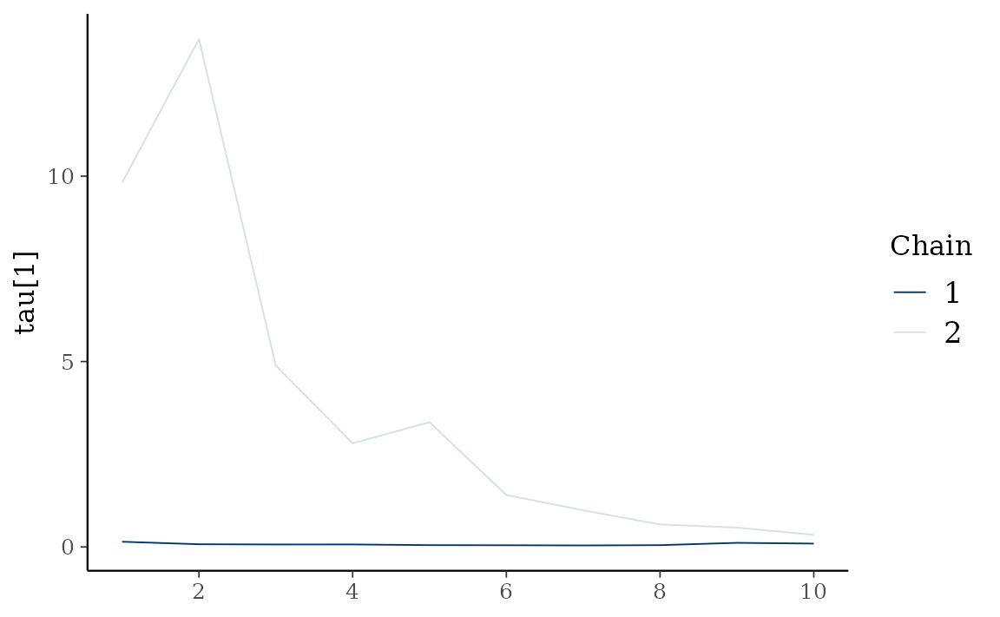
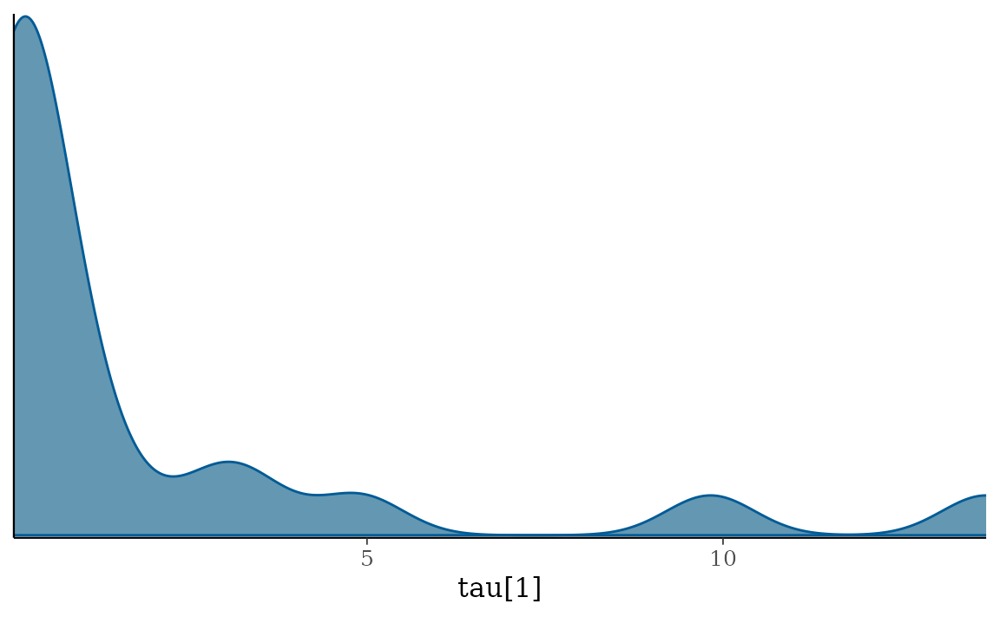

# Stochastic Volatility Models

``` r

library(bvhar)
```

``` r

etf <- etf_vix[1:55, 1:3]
# Split-------------------------------
h <- 5
etf_eval <- divide_ts(etf, h)
etf_train <- etf_eval$train
etf_test <- etf_eval$test
```

## Models with Stochastic Volatilities

By specifying `cov_spec = set_sv()`,
[`var_bayes()`](../reference/var_bayes.md) and
[`vhar_bayes()`](../reference/vhar_bayes.md) fits VAR-SV and VHAR-SV
with shrinkage priors, respectively.

- Three different prior for innovation covariance, and specify through
  `coef_spec`
  - Minneosta prior
    - BVAR: [`set_bvar()`](../reference/set_bvar.md)
    - BVHAR: [`set_bvhar()`](../reference/set_bvar.md) and
      [`set_weight_bvhar()`](../reference/set_bvar.md)
  - SSVS prior: [`set_ssvs()`](../reference/set_ssvs.md)
  - Horseshoe prior: [`set_horseshoe()`](../reference/set_horseshoe.md)
  - NG prior: [`set_ng()`](../reference/set_ng.md)
  - DL prior: [`set_dl()`](../reference/set_dl.md)
- `sv_spec`: prior settings for SV,
  [`set_sv()`](../reference/set_ldlt.md)
- `intercept`: prior for constant term,
  [`set_intercept()`](../reference/set_intercept.md)

``` r

set_sv()
#> Model Specification for SV with Cholesky Prior
#> 
#> Parameters: Contemporaneous coefficients, State variance, Initial state
#> Prior: Cholesky
#> ========================================================
#> Setting for 'shape':
#> [1]  rep(3, dim)
#> 
#> Setting for 'scale':
#> [1]  rep(0.01, dim)
#> 
#> Setting for 'initial_mean':
#> [1]  rep(1, dim)
#> 
#> Setting for 'initial_prec':
#> [1]  0.1 * diag(dim)
```

### SSVS

``` r

(fit_ssvs <- vhar_bayes(etf_train, num_chains = 2, num_iter = 20, coef_spec = set_ssvs(), cov_spec = set_sv(), include_mean = FALSE, minnesota = "longrun"))
#> Call:
#> vhar_bayes(y = etf_train, num_chains = 2, num_iter = 20, coef_spec = set_ssvs(), 
#>     cov_spec = set_sv(), include_mean = FALSE, minnesota = "longrun")
#> 
#> BVHAR with Stochastic Volatility
#> Fitted by Gibbs sampling
#> Number of chains: 2
#> Total number of iteration: 20
#> Number of burn-in: 10
#> ====================================================
#> 
#> Parameter Record:
#> # A draws_df: 10 iterations, 2 chains, and 177 variables
#>      phi[1]   phi[2]    phi[3]  phi[4]  phi[5]   phi[6]   phi[7]  phi[8]
#> 1    0.8983   0.0916  -0.08285  -0.223   0.420  -0.1006  -0.0074  -0.506
#> 2    0.1141  -0.0177  -0.02866   0.301  -0.467   0.0932  -0.2125   0.097
#> 3    0.4094  -0.0727  -0.08276  -2.338   1.689  -0.2091   0.3407   0.153
#> 4   -0.7451  -0.0405   0.30052  -0.431   1.580   0.3140  -0.3870  -0.615
#> 5   -0.3590  -0.0122   0.13990  -0.308   0.324   0.2449  -1.0757  -0.887
#> 6    0.4698   0.0172   0.10019   0.387   0.848   0.4196  -0.9154  -0.390
#> 7   -0.0563   0.0171   0.20512   0.053  -0.139   0.4587  -0.8198  -0.398
#> 8    0.0203  -0.0556   0.36827   0.103  -0.108   0.5757  -0.8963  -0.411
#> 9   -0.0478  -0.0415  -0.01221   0.219   0.499   0.3785  -1.1770  -0.741
#> 10   0.0488  -0.0428   0.00395   0.288   0.245   0.3055  -1.5580  -0.669
#> # ... with 10 more draws, and 169 more variables
#> # ... hidden reserved variables {'.chain', '.iteration', '.draw'}
```

### Horseshoe

``` r

(fit_hs <- vhar_bayes(etf_train, num_chains = 2, num_iter = 20, coef_spec = set_horseshoe(), cov_spec = set_sv(), include_mean = FALSE, minnesota = "longrun"))
#> Call:
#> vhar_bayes(y = etf_train, num_chains = 2, num_iter = 20, coef_spec = set_horseshoe(), 
#>     cov_spec = set_sv(), include_mean = FALSE, minnesota = "longrun")
#> 
#> BVHAR with Stochastic Volatility
#> Fitted by Gibbs sampling
#> Number of chains: 2
#> Total number of iteration: 20
#> Number of burn-in: 10
#> ====================================================
#> 
#> Parameter Record:
#> # A draws_df: 10 iterations, 2 chains, and 211 variables
#>      phi[1]   phi[2]     phi[3]   phi[4]  phi[5]     phi[6]     phi[7]   phi[8]
#> 1    0.2362  -0.0517  -1.66e-03   0.1833  0.2019  -2.30e-02   0.598424   0.1207
#> 2    0.1831  -0.1090   8.89e-03   0.0232  0.1758  -6.96e-02   0.976298   0.1574
#> 3    0.2455  -0.0703  -8.73e-03  -0.1382  0.4007   1.21e-01   0.278064  -0.0106
#> 4    0.0963  -0.1558   5.65e-03   0.1070  0.3291   7.34e-05   0.150997   0.2911
#> 5    0.0372  -0.1538  -2.67e-03  -0.0237  0.2017   7.37e-02   0.069690  -0.1158
#> 6   -0.0573  -0.2566   7.73e-04   0.0156  0.3059   3.76e-02   0.006501  -0.1023
#> 7    0.1053  -0.1837   1.80e-03   0.0697  0.0482   5.19e-02  -0.016241   0.5553
#> 8    0.0232  -0.1501  -2.18e-04   0.0191  0.7933   1.06e-01   0.013617  -0.2976
#> 9    0.0504  -0.1617   9.16e-05  -0.0346  0.2741   3.42e-02   0.006662   0.0159
#> 10   0.0223  -0.1558  -1.42e-04   0.0992  0.4527   2.04e-01  -0.000531  -0.0219
#> # ... with 10 more draws, and 203 more variables
#> # ... hidden reserved variables {'.chain', '.iteration', '.draw'}
```

### Normal-Gamma prior

``` r

(fit_ng <- vhar_bayes(etf_train, num_chains = 2, num_iter = 20, coef_spec = set_ng(), cov_spec = set_sv(), include_mean = FALSE, minnesota = "longrun"))
#> Call:
#> vhar_bayes(y = etf_train, num_chains = 2, num_iter = 20, coef_spec = set_ng(), 
#>     cov_spec = set_sv(), include_mean = FALSE, minnesota = "longrun")
#> 
#> BVHAR with Stochastic Volatility
#> Fitted by Metropolis-within-Gibbs
#> Number of chains: 2
#> Total number of iteration: 20
#> Number of burn-in: 10
#> ====================================================
#> 
#> Parameter Record:
#> # A draws_df: 10 iterations, 2 chains, and 184 variables
#>      phi[1]   phi[2]  phi[3]    phi[4]    phi[5]   phi[6]   phi[7]  phi[8]
#> 1   -0.1124   0.6904  -0.321  -0.00321   1.43323   0.2172   1.0315   0.466
#> 2    0.2515  -0.1249  -0.385  -0.02597  -0.28306   0.0433   0.9728   0.391
#> 3    0.2726   0.0824   0.336   0.04893  -0.00217   0.2540   1.5225   0.789
#> 4    0.1054  -0.1335   0.273   0.18284  -0.63827  -0.1044   0.8196   0.403
#> 5   -0.0630  -0.3026  -0.268  -0.03282   0.58118   0.1097   0.3002   0.267
#> 6   -0.0812  -0.1539  -0.449   0.06099   2.09660  -0.2109  -0.2283   0.169
#> 7    0.0609  -0.0255  -1.249  -0.06351   2.26959   0.0803   0.2321   0.153
#> 8    0.0578   0.0188  -1.501  -0.01819   3.10548   0.0534  -0.0573   0.147
#> 9    0.0511  -0.0176  -1.489  -0.29220   3.54922   0.0302  -0.9825  -0.360
#> 10   0.0543  -0.3743  -1.038   0.08516   1.10071  -0.0176  -1.7240  -1.124
#> # ... with 10 more draws, and 176 more variables
#> # ... hidden reserved variables {'.chain', '.iteration', '.draw'}
```

### Dirichlet-Laplace prior

``` r

(fit_dl <- vhar_bayes(etf_train, num_chains = 2, num_iter = 20, coef_spec = set_dl(), cov_spec = set_sv(), include_mean = FALSE, minnesota = "longrun"))
#> Call:
#> vhar_bayes(y = etf_train, num_chains = 2, num_iter = 20, coef_spec = set_dl(), 
#>     cov_spec = set_sv(), include_mean = FALSE, minnesota = "longrun")
#> 
#> BVHAR with Stochastic Volatility
#> Fitted by Gibbs sampling
#> Number of chains: 2
#> Total number of iteration: 20
#> Number of burn-in: 10
#> ====================================================
#> 
#> Parameter Record:
#> # A draws_df: 10 iterations, 2 chains, and 178 variables
#>       phi[1]     phi[2]    phi[3]   phi[4]   phi[5]     phi[6]     phi[7]
#> 1    0.16969  -0.126475  -0.00613   0.2047   0.7745   0.383276   8.47e-03
#> 2    0.13486  -0.148850  -0.00510   0.1231   0.4699   0.247205   9.44e-05
#> 3    0.09879   0.012937  -0.00992   0.0190   0.5744   0.042933   5.50e-05
#> 4   -0.05609  -0.009510  -0.04458  -0.0160   0.6282   0.041425   3.27e-03
#> 5    0.00416   0.007852  -0.01198   0.0647   0.7835   0.019642  -3.80e-03
#> 6   -0.00753  -0.053984   0.01830  -0.1006   0.8483  -0.000763   1.37e-03
#> 7    0.03670  -0.129178   0.00700   0.1877   0.0771   0.004746  -8.30e-02
#> 8    0.04795  -0.091950   0.02061   0.4122  -0.2505  -0.002448  -5.12e-02
#> 9    0.00318   0.000964  -0.00825   0.3645  -0.0856  -0.001270   1.32e-01
#> 10   0.04623   0.000799   0.02443   0.3980   0.0134  -0.004120  -3.10e-02
#>       phi[8]
#> 1    0.00178
#> 2    0.00459
#> 3    0.00551
#> 4    0.01333
#> 5    0.01350
#> 6    0.00149
#> 7   -0.01615
#> 8    0.00544
#> 9   -0.00188
#> 10  -0.01101
#> # ... with 10 more draws, and 170 more variables
#> # ... hidden reserved variables {'.chain', '.iteration', '.draw'}
```

### Bayesian visualization

[`autoplot()`](https://ggplot2.tidyverse.org/reference/autoplot.html)
also provides Bayesian visualization. `type = "trace"` gives MCMC trace
plot.

``` r

autoplot(fit_hs, type = "trace", regex_pars = "tau")
```



`type = "dens"` draws MCMC density plot.

``` r

autoplot(fit_hs, type = "dens", regex_pars = "tau")
```


