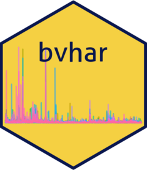

<!-- README.md is generated from README.qmd. Please edit that file -->

# bvhar <a href="https://github.com/ygeunkim/bvhar/tree/feature/python/python/"></a>

<!-- badges: start -->

[](https://github.com/ygeunkim/bvhar/actions/workflows/py-conda-check.yaml?query=branch%3Afeature%2Fpython)
[](https://github.com/ygeunkim/bvhar/actions/workflows/py-pip-check.yaml?query=branch%3Afeature%2Fpython)
[](https://github.com/ygeunkim/bvhar/actions/workflows/py-wheel-check.yaml?query=branch%3Afeature%2Fpython)
[](https://github.com/ygeunkim/bvhar/actions/workflows/py-sdist-check.yaml?query=branch%3Afeature%2Fpython)
[](https://app.codecov.io/gh/ygeunkim/bvhar)

<!-- badges: end -->

This is `bvhar` package for python. We aims to add every feature in R
package.

| Model |    Class    |               prior                |
|:-----:|:-----------:|:----------------------------------:|
|  VAR  |  `VarOls`   |                                    |
| VHAR  |  `VharOls`  |                                    |
| BVAR  | `VarBayes`  | SSVS, Horseshoe, Minnesota, NG, DL |
| BVHAR | `VharBayes` | SSVS, Horseshoe, Minnesota, NG, DL |

## Installation

### Eigen and boost usage

`bvhar` uses Eigen and boost headers in C++ sources. If you use `eigen`
and `boost-cpp` in conda with the conda environment, you don’t have to
take care of them.

``` bash
conda env create -f requirements/environment.yml
conda activate bvhar-env
```

Otherwise, you should set their paths by yourself; at this stage.

- `EIGEN_INCLUDE_DIR`: Eigen path that includes the eigen headers
- `BOOST_INCLUDE_DIR`: boost path that includes the boost headers

### Developement version

In this `python` directory:

``` bash
git clone -b feature/python https://github.com/ygeunkim/bvhar.git
cd python
# use conda script abvoe if you use conda
pip install -e .
```
